# Nimbus project visualizations

This folder contains three editable, code-based views of the project:

- `nimbus-overview.d2` — the compact, first-glance project architecture.
- `nimbus-system-architecture.d2` — the detailed end-to-end runtime and decision flow.
- `nimbus-repository-map.d2` — source ownership and the three scored submission boundaries.

Each source is rendered in light and dark SVG variants, plus a light PNG for
documents and slides. The SVGs bundle their icons, so they are self-contained.

Open `index.html` for the interactive viewer with view tabs, theme switching,
fit-to-screen, zoom, and drag-to-pan controls. It is dependency-free and can be
opened directly from the filesystem.

## Project overview

<picture>
  <source media="(prefers-color-scheme: dark)" srcset="nimbus-overview-dark.svg">
  
</picture>

## Detailed system architecture

<picture>
  <source media="(prefers-color-scheme: dark)" srcset="nimbus-system-architecture-dark.svg">
  
</picture>

## Repository and submission map

<picture>
  <source media="(prefers-color-scheme: dark)" srcset="nimbus-repository-map-dark.svg">
  
</picture>

## Regenerate

Use the Databricks architecture-diagram skill's D2 wrapper; it prepends the
shared theme and embeds the bundled icons. Do not run raw `d2` directly against
these sources because `${ICONS}` is resolved by the wrapper.

```bash
ARCH_SKILL="$HOME/.codex/plugins/cache/isaac-sync-fe-vibe/fe-workflows/1.6.5/skills/fe-architecture-diagram"
RENDER="$ARCH_SKILL/resources/scripts/render_d2.sh"

bash "$RENDER" --both docs/architecture/nimbus-system-architecture.d2 \
  docs/architecture/nimbus-system-architecture.svg
bash "$RENDER" --both docs/architecture/nimbus-overview.d2 \
  docs/architecture/nimbus-overview.svg

bash "$RENDER" --both docs/architecture/nimbus-repository-map.d2 \
  docs/architecture/nimbus-repository-map.svg
```

The PNG files are rasterized from the light SVGs with `rsvg-convert` for local
sharing; the SVGs are the canonical rendered outputs.

The diagrams intentionally describe the project from the checked-in source and
evidence. They do not query or mutate a live Databricks workspace.
